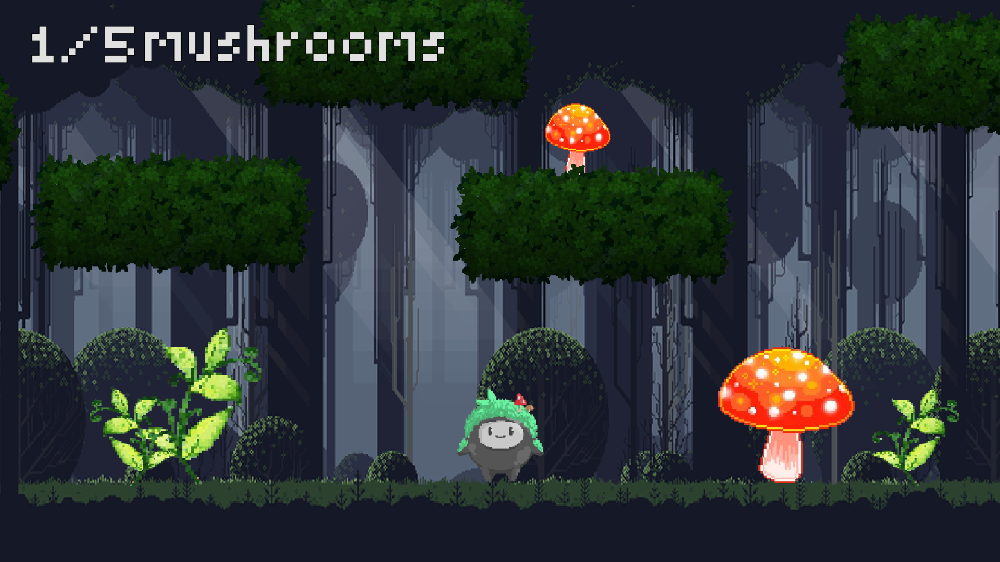

# Rockie's Origins 🌱🪨

**A Platform Adventure Game Developed for Global Game Jam 2023**

Kindly hosted by NCGM at FEUP, "Rockie's Origins" is a platformer created during the Global Game Jam 2023 using Gamemaker and developed within 48 hours by our group, "The Owls", composed of 5 elements. The theme was "roots," and we explored this theme in both literal and metaphorical senses, crafting a journey that reflects both nature’s grounding presence and a deeper sense of family heritage.

## 🌄 Story Overview

In "Rockie's Origins," you play as **Rockie**, a young rock on a quest through forests and rocky environments to free his mother, who is bound by the roots of a mystical tree. As Rockie ventures deeper into the forest, he meets his siblings who ask him to help them with simple quests. Through their conversations, Rockie gains insights into his heritage, learning about the strength of bonds that connect his family and how they relate to the world around them.

In the end, Rockie reaches his mother and learns a profound lesson: life, like games, is made up of phases. His mother gently explains that what may seem like an obstacle (the tree that planted it's roots) is actually a source of connection and life for their family and the forest ecosystem. 

With our story we intend for the players to experience that life is about growth and adaptation; our connections are what give us purpose and stability.

## 🎮 Gameplay

"Rockie's Origins" includes three distinct levels:
1. **Forest of Roots** 🌲 – Traverse through a dense, ancient forest avoiding the spiky roots.
2. **Mushroom Grove** 🍄 – Explore a magical mushroom forest, collecting mushrooms to help his sibling.
3. **Ancestral Mountain** 🏔️ – The final, challenging area where Rockie finds his mother and learns about the importance of his roots.

### Key Features
- **Mechanics**: Navigate through challenging terrains, and collect items.
- **Interactive Dialogue**: Engage in meaningful conversations with Rockie’s family, gaining wisdom along the way.
- **Puzzle Elements**: Help Rockie's siblings by collecting flowers, mushrooms, and discovering your way out.

## 🌱 Inspiration and Theme

The game’s aesthetic and narrative were inspired by the theme of "roots" in two ways:
- **Visual Roots**: Roots are woven into the environment design and obstacles, symbolizing connection and growth.
- **Heritage and Family Roots**: Rockie’s journey through the forest symbolizes reconnecting with one's origins, learning from family, and understanding our place within a larger community.

## 🎉🙌 Acknowledgments

We would like to thank everyone who participated in the Game Jam and the NCGM group at FEUP for hosting this inspiring event. We hope you enjoy **Rockie's Origins** as much as we enjoyed developing it! 

## 📷 Screenshots

*Figure 1: The Start Menu*

*Figure 2: Level 1*

*Figure 3: Level 2*

*Figure 4: Level 3*

*Figure 5: Owl instructing player how to interact*

*Figure 6: Rockie chatting with his brother*

